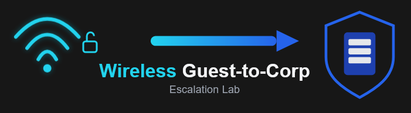

<a id="readme-top"></a>


<!-- PROJECT SHIELDS -->
<!--
*** I'm using markdown "reference style" links for readability.
*** Reference links are enclosed in brackets [ ] instead of parentheses ( ).
*** See the bottom of this document for the declaration of the reference variables
*** for contributors-url, forks-url, etc. This is an optional, concise syntax you may use.
*** https://www.markdownguide.org/basic-syntax/#reference-style-links
-->
[![Contributors][contributors-shield]][contributors-url]
[![Forks][forks-shield]][forks-url]
[![Stargazers][stars-shield]][stars-url]
[![Issues][issues-shield]][issues-url]
[![project_license][license-shield]][license-url]
[![LinkedIn][linkedin-shield]][linkedin-url]


<!-- PROJECT LOGO -->
<div align="center">
  <a href="https://github.com/Server2090/Wireless_Escalation_Lab">
    
  </a>

<h3 align="center">Wireless Escalation Lab</h3>

  <p align="center">
    The Wireless Escalation Lab is a hands on offensive security exercise where simulate a red team assessment against a small enterprise Wi-Fi environment using only laptops, two consumer routers, and a Wi-Fi Pineapple. Students first compromise a vulnerable WPA2 Guest Wi-Fi network by capturing and cracking a WPA2 handshake with a password found in a wordlist. Then students deploy an evil twin access point to phish router administration credentials from a scripted employee laptop accessing the router admin webpage over the Guest network. Students may also pivot to capture credentials via network sniffing as well. Using these stolen credentials from the Guest network, they must log into the router, misconfigure the port forward rules to pivot into an internal Corp network hosting a simple intranet web service that exposes a flag. This lab is designed for high school or introductory college cybersecurity students and emphasizes realistic wireless attack chaining including recon, WPA2 cracking, evil twin, credential harvesting, network sniffing, segmentation bypass, all in a controlled single room environment. 
    <br />
    <a href="https://github.com/Server2090/Wireless_Escalation_Lab"><strong>Explore the docs »</strong></a>
    <br />
    <br />
    <a href="https://github.com/Server2090/Wireless_Escalation_Lab">View Demo</a>
    &middot;
    <a href="https://github.com/Server2090/Wireless_Escalation_Lab/issues/new?labels=bug&template=bug-report---.md">Report Bug</a>
    &middot;
    <a href="https://github.com/Server2090/Wireless_Escalation_Lab/issues/new?labels=enhancement&template=feature-request---.md">Request Feature</a>
  </p>
</div>


<!-- TABLE OF CONTENTS -->
<details>
  <summary>Table of Contents</summary>
  <ol>
    <li>
      <a href="#about-the-project">About The Project</a>
      <ul>
        <li><a href="#built-with">Built With</a></li>
      </ul>
    </li>
    <li>
      <a href="#getting-started">Getting Started</a>
      <ul>
        <li><a href="#prerequisites">Prerequisites</a></li>
        <li><a href="#installation">Installation</a></li>
      </ul>
    </li>
    <li><a href="#usage">Usage</a></li>
    <li><a href="#roadmap">Roadmap</a></li>
    <li><a href="#contributing">Contributing</a></li>
    <li><a href="#license">License</a></li>
    <li><a href="#contact">Contact</a></li>
  </ol>
</details>


<!-- ABOUT THE PROJECT -->
## About The Project

The Wireless Escalation Lab is a hands on offensive security exercise where simulate a red team assessment against a small enterprise Wi-Fi environment using only laptops, two consumer routers, and a Wi-Fi Pineapple. Students first compromise a vulnerable WPA2 Guest Wi-Fi network by capturing and cracking a WPA2 handshake with a password found in a wordlist. Then students deploy an evil twin access point to phish router administration credentials from a scripted employee laptop accessing the router admin webpage over the Guest network. Students may also pivot to capture credentials via network sniffing as well. Using these stolen credentials from the Guest network, they must log into the router, misconfigure the port forward rules to pivot into an internal Corp network hosting a simple intranet web service that exposes a flag. This lab is designed for high school or introductory college cybersecurity students and emphasizes realistic wireless attack chaining including recon, WPA2 cracking, evil twin, credential harvesting, network sniffing, segmentation bypass, all in a controlled single room environment. 

<p align="right">(<a href="#readme-top">back to top</a>)</p>


### Built With

* [![Bash][Bash]][https://www.gnu.org/software/bash/]
* [![Airmon-ng][Airmon-ng]][https://www.aircrack-ng.org/doku.php?id=airmon-ng]
* [![OpenWRT][OpenWRT]][https://openwrt.org/]
* [![WiFi Pineapple][WiFi Pineapple]][https://shop.hak5.org/products/wifi-pineapple?srsltid=AfmBOopoykWvL-R0-0LLCEkLT5bYMokMqKTRXoR7temh2MM2-bLOSAn2]
* [![Wireshark][Wireshark]][https://www.wireshark.org/l]
* [![Python][Python]][https://www.python.org/]
<p align="right">(<a href="#readme-top">back to top</a>)</p>


<!-- GETTING STARTED -->
## Getting Started

###### Guest Router (ECC-GUEST) Initial Configuration (Simulated Employee Laptop)
1. **Factory reset the router**
	- Hold the physical reset button for 30 seconds until the default linksys wireless network appears
	- Temporarily set the laptop to a static IP in the same subnet (for example `192.168.1.5/24`)
2. **Access the default web interface**
	- Connect via Ethernet
	- In a browser, navigate to `http://192.168.1.1`
	- Login with:
		- Username: (leave blank)
		- Password: `admin`
3. **Basic Setup (Setup → Basic Setup)**
	- Internet (WAN) connection type: **Automatic Configuration – DHCP**
	- Gateway and DNS: **leave at defaults** (autoconfig via DHCP)
	- Router Name: `ECC-GUEST`
	- Host Name: `ECC-GUEST`
	- Domain Name: `ECC`
	- Local IP Address: `192.168.1.1`
	- Subnet Mask: `255.255.255.0`
	- DHCP Server: **Enabled**
	- Starting IP Address: `192.168.1.100`
	- Maximum Number of DHCP Users: `100`
	- Time Zone: set to Eastern Time
4. **Wireless Configuration (Wireless → Basic Wireless Settings)**
	- Wireless Network Name (SSID): `ECC-GUEST`
	- Wireless Mode/Channel: **leave at defaults or set as desired for your lab**
5. **Wireless Security (Wireless → Wireless Security)**
	- Security Mode: **WPA2 Personal**
	- Encryption: **AES**
	- WPA Shared Key: `corpwirelessnetwork`
6. **Administration hardening (Administration → Management)**
	- Router Password: `AdminSecure123!`
	- Confirm Password: `AdminSecure123!`
	- Save and apply settings.
7. **Logging (Administration → Log)**
	- Log: **Enable**
	- Apply settings.
8. **Optional: Backup configuration (Administration → Config Management)**
	- Use the Backup option to download the current configuration so it can be restored quickly if you need to re‑deploy this lab router


###### Corp Router (ECC-CORP) Initial Configuration (Simulated Employee Laptop)
1. **Factory reset the router**
	- Hold the physical reset button for 30 seconds until the default linksys wireless network appears
	- Temporarily set the laptop to a static IP in the same subnet (for example `192.168.1.5/24`)
2. **Access the default web interface**
	- Connect via Ethernet
	- In a browser, navigate to `http://192.168.1.1/24`
	- Login with:
		- Username: (leave blank)
		- Password: `admin`
3. **Basic Setup (Setup → Basic Setup)**
	- Internet (WAN) connection type: **Automatic Configuration – DHCP**
	- Gateway and DNS: **leave at defaults** (autoconfig via DHCP)
	- Router Name: `ECC-CORP`
	- Host Name: `ECC-CORP`
	- Domain Name: `ECC`
	- Local IP Address: `192.168.2.1`
	- Subnet Mask: `255.255.255.0`
	- DHCP Server: **Enabled**
	- Starting IP Address: `192.168.2.100`
	- Maximum Number of DHCP Users: `100`
	- Time Zone: set to Eastern Time
4. **Wireless Configuration (Wireless → Basic Wireless Settings)**
	- Wireless Network Name (SSID): `ECC-CORP`
	- Wireless Mode/Channel: **leave at defaults or set as desired for your lab**
5. **Wireless Security (Wireless → Wireless Security)**
	- Security Mode: **WPA2 Personal**
	- Encryption: **AES**
	- WPA Shared Key: `NotEverCrackableInThisTimeFrame67!`
6. **Administration hardening (Administration → Management)**
	- Router Password: `ThisTime1`
	- Confirm Password: `ThisTime1`
	- Save and apply settings
7. **Logging (Administration → Log)**
	- Log: **Enable**
	- Apply settings.
8. **Optional: Backup configuration (Administration → Config Management)**
	- Use the Backup option to download the current configuration so it can be restored quickly if you need to re‑deploy this lab router
###### WiFi Pineapple Setup (Attacker Laptop)
 1. **Connect the Pineapple to the laptop**
	- Use wired USB-C connection to connect the WiFi Pineapple to the laptop
2. **Connect to WiFi Pineapple**
	-  Temporarily set the laptop to a static IP in the same subnet (for example `192.168.1.5/24`)
	- Navigate to `http://172.16.42.1:1471`
	- Pineapple Username: `root`
	- Pineapple Password: `hak5pineapple`
3. **Setup new WiFi Pineapple Password**


### Prerequisites

**Networking Hardware**
* 2 Linksys WRT54G Routers with stock firmware
* 1 Wi-Fi Pineapple
**Endpoints and Hosts**
* 1× instructor/victim laptop running Ubuntu or Kali Linux (used for automation scripts and simulated user activity)
- 1× device to host the “Corp intranet” service (this can be the same Linux laptop, a Raspberry Pi, or another PC capable of running a simple HTTP server)
- 1× or more student laptops with Wi‑Fi and a modern web browser
**Software requirements (on the Linux host)**
- NetworkManager (`nmcli`) for managing Wi‑Fi connections
- A web browser (Firefox or Firefox ESR)
- `xdotool` for scripted keyboard input into the browser
- Python 3 (for running a basic HTTP server to host the backend/intranet page)

### Installation
1. Complete the [[#Getting Started]] section
2. Setup the [[#Simulated Employee Laptop]]
3. Setup the [[#Corp Intranet Server Setup (Intranet Device)]]

###### Simulated Employee Laptop
1. Clone the repo
   ```sh
   git clone https://github.com/Server2090/Wireless_Escalation_Lab.git
   cd scripts_and_services/
   ```
2. Configure the Scripts
```sh
vi router_autologin.service

#Change the $username to the username
```
3. Install Required Services
   ```sh
   mv router_autologin.service /etc/systemd/system
   mv wifi_keepalive.service /etc/systemd/system
   mkdir /usr/local/lib/router_autologin/
   mkdir /usr/local 
   ```
4. Install Required Scripts
   ```sh
   mkdir /usr/local/lib/router_autologin/
   mkdir /usr/local/lib/wifi_keepalive/
   mv auto_connect.sh /usr/local/lib/wifi_keepalive/
   mv router_autologin.sh /usr/local/lib/router_autologin/
   ```
5. Create Persistent Profile for WiFi Auto Reconnect
```sh
chmod +x create_persistent_connection_profile.sh
./create_persistent_connection_profile.sh
```
3. Enable and start services
```sh
sudo systemctl enable router_autologin.service
sudo systemctl enable wifi_keepalive.service
sudo systemctl start wifi_keepalive.service
sudo systemctl start router_autologin.service
```
3. Allow the services to auto execute and connect to the two routers


###### Corp Intranet Server Setup (Intranet Device)
1. Install Python3
```sh
sudo apt update
sudo apt install -y python3
```
2.  Setup HTML File 
```sh
mv index.html /var/www/html
```
3. Start Python3 Server
```sh
cd /var/www/html
sudo python3 -m http.server 80 bind 0.0.0.0
```

<p align="right">(<a href="#readme-top">back to top</a>)</p>


<!-- USAGE EXAMPLES -->
## Usage

##### Attack Flow (3 Stages, Both Cracking + Evil Twin Required)

**Stage 1: Crack ECC-GUEST PSK**
Deauth victim → capture handshake → crack PSK → Flag 1 (crack screenshot).

**Stage 2: Evil Twin + DNS Spoof**
Hak5 evil twin (same SSID/PSK, stronger signal) → deauth victim → auto-joins → DNS spoof 192.168.1.1 → victim types username/password → Flag 2 (captured creds).

**Stage 3: Guest → Corp Escalation**
Join real ECC-GUEST (cracked PSK) → login real router (phished creds) → modify firewall/port-forward → reach corp resources → Flag 3.

<p align="right">(<a href="#readme-top">back to top</a>)</p>


<!-- ROADMAP -->
## Roadmap

- [ ] Short Term
	- [ ] Refine setup documentation with screenshots and troubleshooting tips
	- [ ] Add step by step student handouts and instructor runbook
	- [ ] Provide example captures (PCAPs) and sample flags for offline practice
- [ ] Medium Term
	- [ ] Add an alternative lab profile using newer hardware with WPA3 support
	- [ ] Include optional blue team extensions (log analysis, incident report, write ups)
	- [ ] Publish ready made VM images or configuration scripts for the victim and intranet hosts
- [ ] Long Term
    - [ ] Develop additional wireless scenarios 
    - [ ] Add automated grading and scoring scripts for flags and lab completion
    - [ ] Create slide decks and assessment materials for instructors adopting the lab

See the [open issues](https://github.com/Server2090/Wireless_Escalation_Lab/issues) for a full list of proposed features (and known issues).

<p align="right">(<a href="#readme-top">back to top</a>)</p>


<!-- CONTRIBUTING -->
## Contributing

Contributions are what make the open source community such an amazing place to learn, inspire, and create. Any contributions you make are **greatly appreciated**.

If you have a suggestion that would make this better, please fork the repo and create a pull request. You can also simply open an issue with the tag "enhancement".

1. Fork the Project
2. Create your Feature Branch (`git checkout -b feature/AmazingFeature`)
3. Commit your Changes (`git commit -m 'Add some AmazingFeature'`)
4. Push to the Branch (`git push origin feature/AmazingFeature`)
5. Open a Pull Request

<p align="right">(<a href="#readme-top">back to top</a>)</p>

### Top contributors:

<a href="https://github.com/Server2090/Wireless_Escalation_Lab/graphs/contributors">
  
</a>


<!-- LICENSE -->
## License

Distributed under the MIT License. See `LICENSE.txt` for more information.

<p align="right">(<a href="#readme-top">back to top</a>)</p>


<!-- CONTACT -->
## Contact

Mintas Ivaska - [LinkedIn](https://linkedin.com/in/mintas-ivaska) - ivaska.mintas@gmail.com

Project Link: [https://github.com/Server2090/Wireless_Escalation_Lab](https://github.com/ServeWireless_Escalation_Lab)

<p align="right">(<a href="#readme-top">back to top</a>)</p>


<!-- MARKDOWN LINKS & IMAGES -->
<!-- https://www.markdownguide.org/basic-syntax/#reference-style-links -->
[contributors-shield]: https://img.shields.io/github/contributors/Server2090/Wireless_Escalation_Lab.svg?style=for-the-badge
[contributors-url]: https://github.com/Server2090/Wireless_Escalation_Lab/graphs/contributors
[forks-shield]: https://img.shields.io/github/forks/Server2090/Wireless_Escalation_Lab.svg?style=for-the-badge
[forks-url]: https://github.com/Server2090/Wireless_Escalation_Lab/network/members
[stars-shield]: https://img.shields.io/github/stars/Server2090/Wireless_Escalation_Lab.svg?style=for-the-badge
[stars-url]: https://github.com/Server2090/Wireless_Escalation_Lab/stargazers
[issues-shield]: https://img.shields.io/github/issues/Server2090/Wireless_Escalation_Lab.svg?style=for-the-badge
[issues-url]: https://github.com/Server2090/Wireless_Escalation_Lab/issues
[license-shield]: https://img.shields.io/github/license/Server2090/Wireless_Escalation_Lab.svg?style=for-the-badge
[license-url]: https://github.com/Server2090/Wireless_Escalation_Lab/blob/master/LICENSE.txt
[linkedin-shield]: https://img.shields.io/badge/-LinkedIn-black.svg?style=for-the-badge&logo=linkedin&colorB=555
[linkedin-url]: https://linkedin.com/in/mintas-ivaska